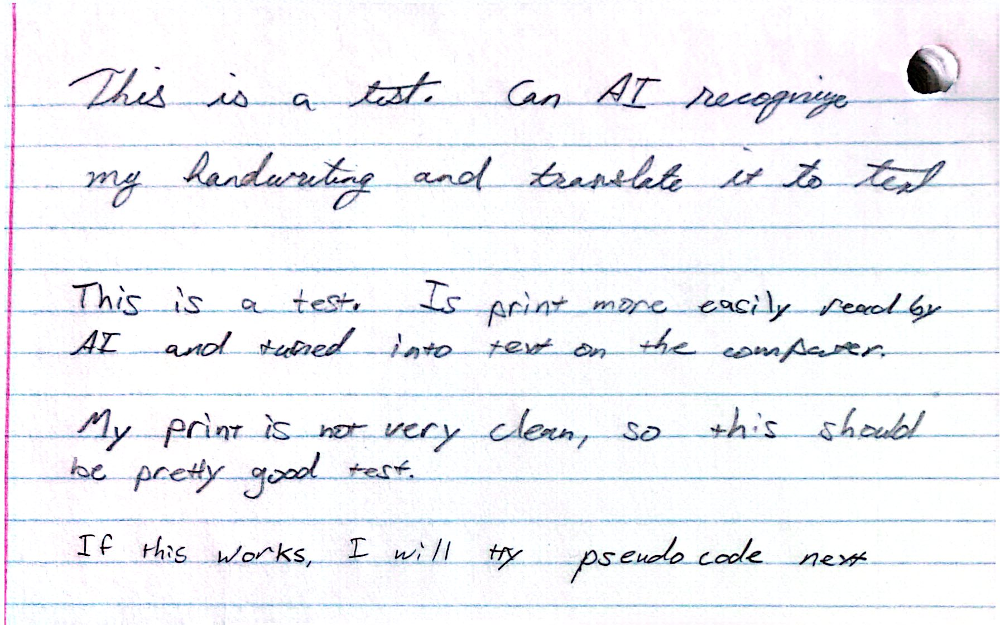
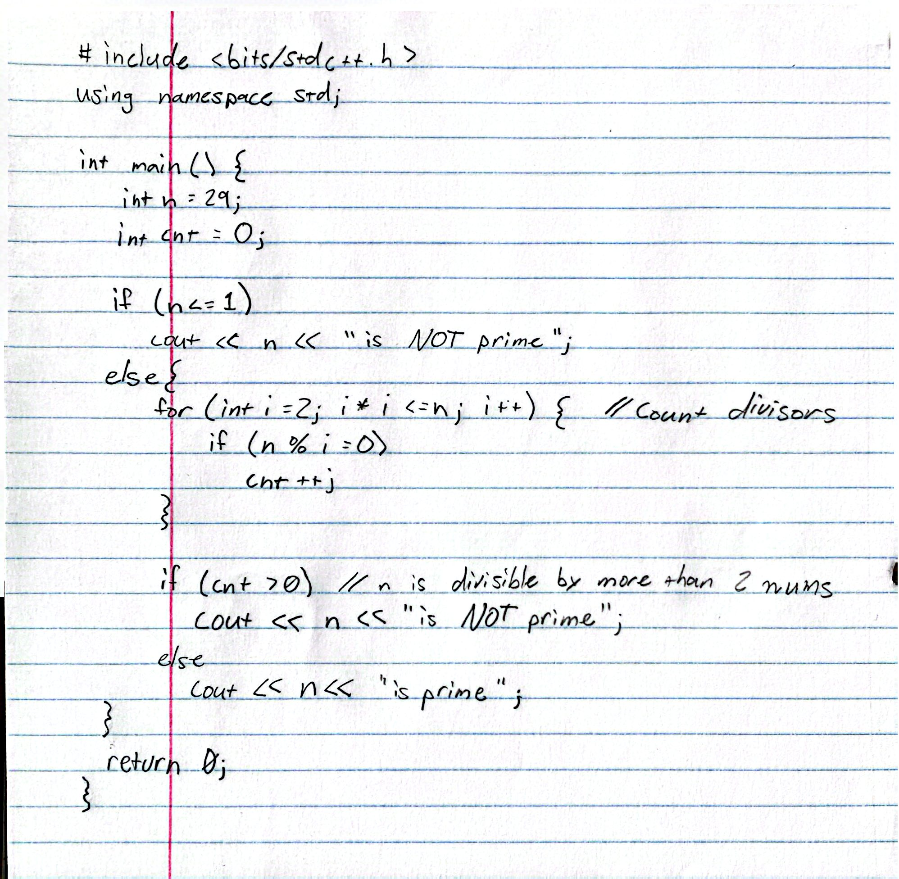

# Locally Run LLM on Morpheus {.unnumbered}  
I installed ollama and gemma4:26b as a test of running an LLM locally on the Weber server.  

My summary is that it performed phenomenally and that I was very surprised at how well it did with the model size, though the Weber server are very clearly powerful. 

### Testing Handwriting Transliteration with Gemma4:26b
I ran the same handwriting test that I did on gemma4-e2b, and on the "Big 3" proprietary models  
The results were identical to the proprietary models 
{width=80%}
```markdown
This is a test. Can AI recognize
my handwriting and translate it to text

This is a test. Is print more easily read by
AI and turned into text on the computer.

My print is not very clean, so this should
be pretty good test.

If this works, I will try pseudo code next
```

- This is fairly uninteresting, as a model this size should accurately do OCR based on gemma4-e2b doing well at it
- I also did the `pseudocode-to-text.jpg` test and it did equivalently well

## Testing Full Syntax C++ Handwriting to Text
### Modelfile creation
I created a `Modelfile` that allows you to "bake in" certain parameters like `temperature` or `top_p` and certain system instructions that will alter the behavior of the model  

- Any `PARAMETER` in a Modelfile can be set at runtime, but doing this allows it to automatically be set 

My `Modelfile` is very simple, but it can already be seen how it alters its behaviour (and not always in a good way)  

### The Handwriting Code Sample

{width=80%}  

#### Handwritten C++ to Text without Modelfile config
- For both tests I will have "thinking" on  
```{cpp}
#include <bits/stdc++.h>
using namespace std;

//int main() {
    int n = 29;
    int cnt = 0;

    if (n <= 1) {
        cout << n << " is NOT prime";
    }
    else {
        // Loop to count divisors
        for (int i = 2; i * i <= n; i++) {
            if (n % i == 0) {
                cnt++;
            }
        }

        if (cnt > 0) // n is divisible by more than 2 nums
            cout << n << " is NOT prime";
        else
            cout << n << " is prime";
    }

    return 0;
//}
```
- The above snippet should also have run at the time of the compilation of the notebook
- I had to manually comment out the main definition and closing bracket because the interpreter doesn't like the `main()` definition for some reason  

#### Handwritten C++ to Text WITH Modelfile config
- I will not be attempting to run the code here
- I also want to note that it initially output it without tabs, but after I asked for it to put the tabs in "like in the image" it did.
```cpp
#include <bits/stdc++.h>
using namespace std;

int main() {
    int n = 29;
    int cnt = 0;

    if (n <= 1)
        cout << n << " is NOT prime";
    else {
        for (int i = 2; i * i <= n; i++) { // Count divisors
            if (n % i == 0)
                cnt++;
        }

        if (cnt > 0) // n is divisible by more than 2 nums
            Cout << n << " is NOT prime";
        else
            Cout << n << " is prime";
    }
    return 0;
}
```
### Notes on the output  
**No Modelfile**  
- The config-less model automatically added curly braces to the single line if statements  
- It correctly interpreted the written handwriting  
- It explained (not included here) what the algorithm was doing  
    - Even the Big O for the solution O($\sqrt{n}$)  
**With Modelfile**  
- Did not add curly braces or fix issues (as specified by the config "do not fix bugs")  
- It did incorrectly interpret `cout` as `Cout`, and it interpretted its mistake in reading it at a mistake on behalf of the student:  
```The user's code has `Cout` (capital C). I must not fix this.```  
- From the "thinking" output of the model  
- This makes the output worse, but I think that the model giving grace toward the student during the transliteration phase could fix this issue  

#### The Stats:
**No Modelfile**
```markdown
total duration:       17.023732221s
load duration:        351.532045ms
prompt eval count:    283 token(s)
prompt eval duration: 69.10374ms
prompt eval rate:     4095.29 tokens/s
eval count:           1815 token(s)
eval duration:        13.914118573s
eval rate:            130.44 tokens/s
```  

**With Modelfile**
```markdown
total duration:       21.960650471s
load duration:        339.849685ms
prompt eval count:    602 token(s)
prompt eval duration: 53.818034ms
prompt eval rate:     11185.84 tokens/s
eval count:           2370 token(s)
eval duration:        18.37346049s
eval rate:            128.99 tokens/s
```  
- The model without the Modelfile configuration ran more quickly and accurately, but did help fix things as expected.  
- I suspect that the smaller context window and less "thinking" about how to alter its output made it output more quickly  
- Sometimes the "thinking" seems to trip the model up. Earlier, I was getting less accurate and much more expensive output with thinking on for the handwriting transliteration. I could explore this further in the future.  